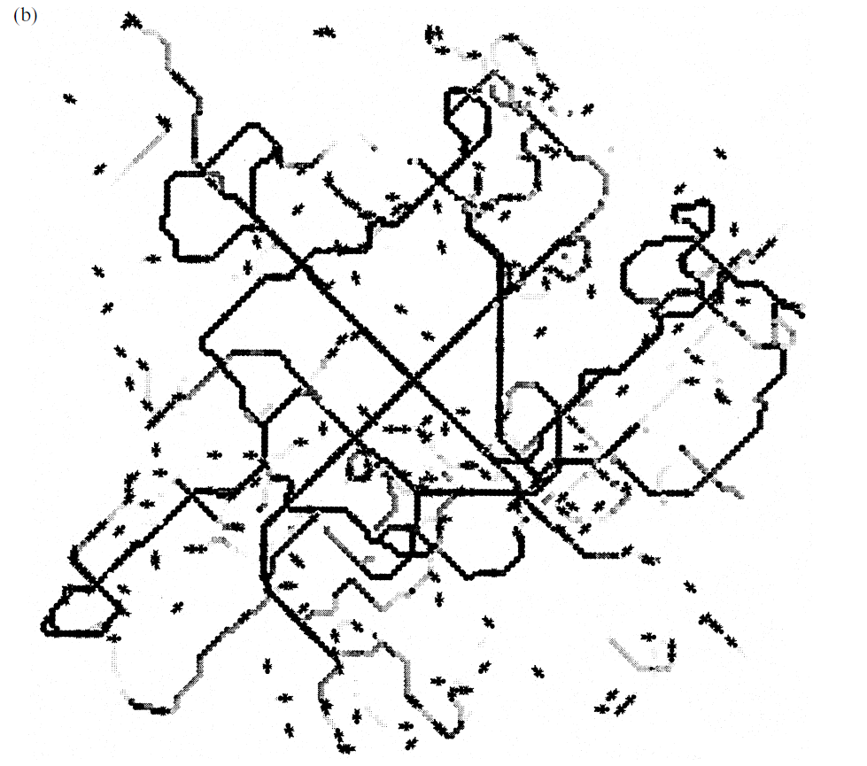
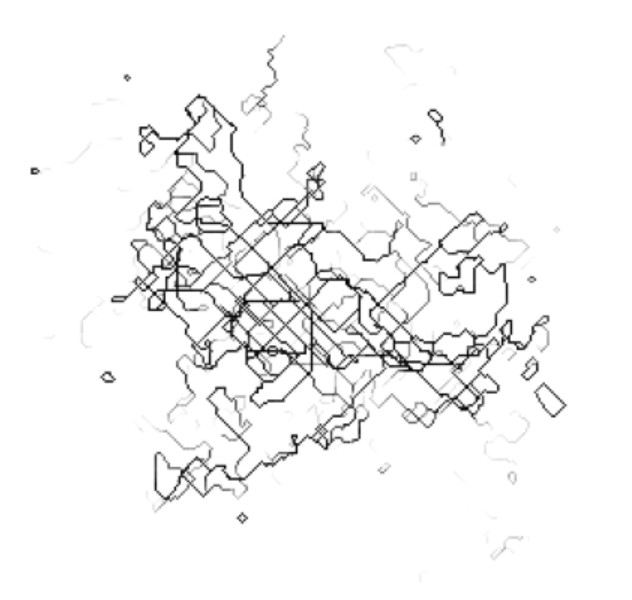

# Project 1: Ants!

### Author: Vedaant Kuchhal

## Aim
The aim of this project is to simulate ant trail patterns using agent-based modelling.

## Background
 This is scientifically relevant since agent-based simulations have proved to be quite useful in explaining complex behaviors in social organisms that have otherwise limited capacity to self-organize.

 This project is based of the model presented by Watmough and Edelstein-Keshet in *Modelling the Formation of Trail Networks by Foraging Ants*. As might be evident from this project's name, the success of this implementation will be benchmarked by its similarity to the trail diagrams and variable relationships noted in the aforementioned paper.

 ## Code Overview
 ### Pre-requisites
 This project is written entirely in [Python](https://www.python.org/), and two libraries outside of base Python 2.0 or higher are required to run the code in this repository. These are:

  - `numpy`
  - `matplotlib`

  Both can be installed appropriately (depending on operating system, other configurations) if not already present. See directions [here](https://docs.python.org/3/installing/index.html) if needed.

  ### Files
  There are three main code files in this repository:

  1. `main.py`: Runtime loop and parameters
  2. `lattice.py`: Lattice class to manage the overall space in which the ants move
  3. `ant.py`: Ant class to represent and manage behaviors of an ant

  ### Running
  To run the code, run `main.py` in your appropriate Python environment (e.g.- entering `python main.py` in a shell).

  In a nutshell, the `main.py` file imports `lattice.py` and creates an instance of the Lattice class. 
  
  `lattice.py` itself imports `ant.py` and creates many instances of Ant classes. These 'ants' then populate the 'lattice'. Each ant follows a very simple set of rules, but when thousands of these ants interact over time through depositing phermones as they move, we see complex trails being formed.

  ## Results
  My implementation closely matched the results that the authors of the paper reached!

Figure 3(b) from paper    |  My figure (same parameters)
:-------------------------:|:-------------------------:
   | 

  As you can see, the implementation and my figure had a similar shape. My figure looks messier with more light trails, but that is likely because of the scaling used. Additionally, the resultant (F/L) ratio for this figure from the paper was 14, and, with the same parameters, I got an average ratio of 15.6!

  Importantly, all the trends from modifying parameters described in the paper were replicated by my implementation:
  
  1)  **Decreasing fidelity decreased the strength of trails** - When fidelity was reduced gradually from 0.9 to 0.6, the mean strength of trails, measured by ratio of following to lost ants, reduced dramatically from around 4.2 to 0.9.

  2) **Reducing deposition rate increased rapid formation of strong trails** - When the rate was decreased form 8 to 4, dominant trails formed more quickly and stayed as they were, whereas at a higher rate no trail was able to clearly dominate. The ratio of followers to lost ants decreased as expected since there were much fewer weak trails.

  3) **Narrowing the turning kernel decreased the tortuosity of trails** - When the turning kernel was changed to bias forward movement, the trails were significantly more straight - going from a complex web to an "X" shape with few bends.

  4) **Increasing the concentration of antennae saturating decreased number of strong trails** - This is tricky since I don't think I implemented this parameter as specified in the paper. The paper was kind of vague about this and never specified the normal value for it. I interpreted it as the maximum phermone concentration allowed on the lattice. When this was increased, there was a more complex web of weak trails as opposed fewer, stronger trails.

  I did not test with the second version of the Forking Algorithm mentioned in the paper, both due to the vagueness of the results and time constraints.

(TODO Discussion: Talk about how it was difficult without C_saturate specified, as well as mechanics of scaling. Also forking wasn't clear, also I had more center clustering)